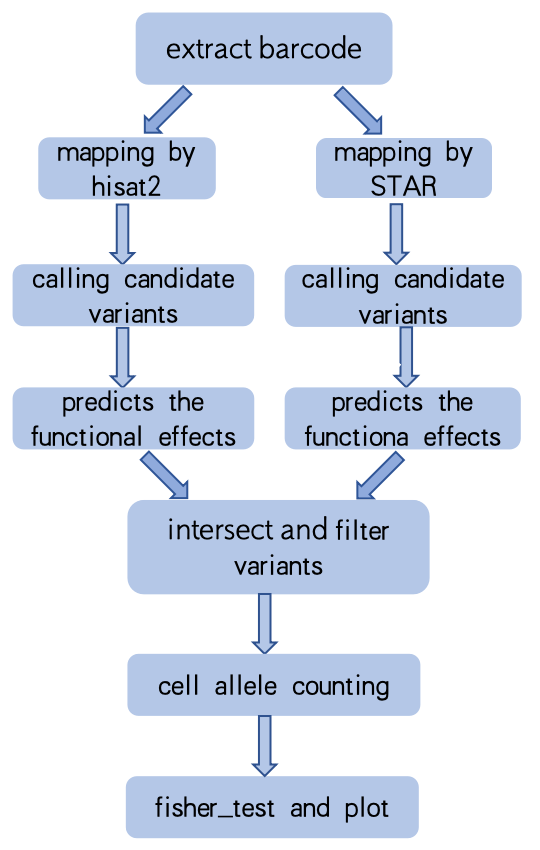

### sc_mut_pipline

SeekOne FAST break the limitations of the conventional 3 'or 5' end transcriptome, and use random primers for random capture and detection of the full transcriptome, resulting in more abundant transcriptome information in the sequencing data. Therefore, the use of full sequence data for variation analysis of single-cell transcriptome data has become a new analysis content. At the same time, for some samples (such as tumor samples), insufficient depth of full sequence data may result in missing detection of some loci. In order to improve the accuracy of gene detection, the corresponding panel enrichment of the full sequence library can be carried out.
In view of the FAST sequence or data variation analysis, after the enrichment of this document reference souporcell software (https://github.com/wheaton5/souporcell) to construct the following pipline.



### requirements

seeksoultools: http://seeksoul.seekgene.com/index.html 

STAR: https://github.com/alexdobin/STAR

hisat: https://github.com/DaehwanKimLab/hisat2

freebayes: https://github.com/freebayes/freebayes

bcftools: https://github.com/samtools/bcftools

VEP: http://useast.ensembl.org/info/docs/tools/vep/script/vep_download.html

VEP database: http://useast.ensembl.org/info/docs/tools/vep/script/vep_cache.html#cache

vatrix: https://github.com/10XGenomics/vartrix

The above software can be downloaded and installed separately or integrated into one environment through conda installation.

```
ref="hisat_idx/hg38.hisat2.genome" （eg.human hg38）
star_index="star_index"
fq1="fastq.R1.gz"
fq2="fastq.R2.gz"
vepcache="software/vep-database"
barcode="barcodes.tsv"
out="outpupath"
```

### Usage

#### 1、extract cell barcode and umi by seeksoultools

```
seeksoultools fast step1 \
    --fq1 $fq1  \
    --fq2 $fq2  \
    --chemistry DD-Q \
    --samplename $sam  \
    --outdir  $out
```

output：sam_1.fq.gz sam_2.fq.gz are paired reads containing valid barcode, respectively.  sam_multi_1.fq.gz and sam_multi_2.fq.gz indicates the paired reads  that matches multiple barcode whitlists during barcode identification; sam_multi.json is the statistics file about the data composition.


#### 2、mapping by hisat2 and STAR

```
fq1=${out}/${sam}/step1/${sam}_1.fq.gz
fq2=${out}/${sam}/step1/${sam}_2.fq.gz

star --runThreadN 13 --limitOutSJcollapsed  5000000 --readMapNumber -1 --genomeDir ${star_index} --readFilesCommand zcat --outFileNamePrefix star --outSAMtype BAM Unsorted --readFilesIn $fq1 $fq2

samtools sort -O BAM -o sort.star.bam starAligned.out.bam

seeksoultools utils addtag --inbam sort.star.bam  --outbam star.tagged_sorted.bam

samtools index star.tagged_sorted.bam

# hisat
hisat2  -t 8 -1 $fq1 -2 $fq2 -x  $ref | samtools sort  -O BAM -o hisat.bam -

seeksoultools utils addtag --inbam hisat.bam  --outbam hisat.tagged_sorted.bam

samtools index hisat.tagged_sorted.bam
```

```
Output descriptions：
    starAligned.out.bam is the bam file which directly aligned and output by STAR software
    sort.star.bam  is the bam file after sorted according to chromosome position
    star.tagged_sorted.bam is to add barcode and UMI information to bam, "CB" and "UB" in tag represent barcode and UMI sequence respectively
    star.tagged_sorted.bam.bai index file
        
    hisat.bam is the bam file after hisat2 software aligns and sorts according to chromosome position
    hisat.tagged_sorted.bam adds barcode and UMI information to the bam after hisat alignment
    hisat.tagged_sorted.bam.bai index file
```

#### 3、calling candidate variants by freebayes and normlize was performed by bcftools

```
# star
freebayes -f ${ref}.fa -Xu -C 2 -q 20 -n 3 -E 40 -m 30 --min-coverage 6 --min-alternate-fraction 0.03  star.tagged_sorted.bam > star.freebayes.vcf

bcftools norm -m +both -Ov -f ${ref}.fa star.freebayes.vcf > norm.star.freebayes.vcf

# hisat

freebayes -f ${ref}.fa -Xu -C 2 -q 20 -n 3 -E 40 -m 30 --min-coverage 6 --min-alternate-fraction 0.03  hisat.tagged_sorted.bam > hisat.freebayes.vcf

bcftools norm -m +both -Ov -f ${ref}.fa hisat.freebayes.vcf > norm.hisat.freebayes.vcf
```

```
Output description: 
    star.freebayes.vcf is a vcf file obtained by freebayes based on the bam file obtained by STAR software
    norm.star.freebayes.vcf is the vcf file after the variation normalized
    hisat.freebayes.vcf is a vcf file obtained by freebayes based on the bam file obtained by hisat2 software
    norm.hisat.freebayes.vcf is the vcf file after the variation normalized

```

#### 4、predicting the functional effects of genomic variants by VEP

```
# star

vep -i norm.star.freebayes.vcf -o star.freebayes.vep.vcf --species homo_sapiens --force --dir_cache $vepcache --sift b  --ccds --symbol --numbers --domains --regulatory --canonical --protein  --biotype --af --af_1kg --max_af --pubmed --uniprot --mane --tsl --appris --variant_class --gene_phenotype --mirna  --merged  --exclude_predicted  --gencode_basic --per_gene  --pick_allele --vcf --offline --hgvs --fasta ${ref}.fa

# hisat
vep -i norm.hisat.freebayes.vcf -o hisat.freebayes.vep.vcf --species homo_sapiens --force --dir_cache $vepcache --sift b  --ccds --symbol --numbers --domains --regulatory --canonical --protein  --biotype --af --af_1kg --max_af --pubmed --uniprot --mane --tsl --appris --variant_class --gene_phenotype --mirna  --merged  --exclude_predicted  --gencode_basic --per_gene  --pick_allele --vcf --offline --hgvs --fasta ${ref}.fa


```

```
Output description: 
    star.freebayes.vep.vcf is the variant information annotation result file of the STAR software alignment result
    star.freebayes.vep.vcf_summary.html is the statistical information of the VEP software annotation result
    hisat.freebayes.vep.vcf is the variant information annotation result file of the hisat2 software alignment result
    hisat.freebayes.vep.vcf_summary.html is the statistical information of the VEP software annotation result
```

#### 5、intersect and filter variants 

```
python filter.py --minimapvcf star.freebayes.vep.vcf --hisatvcf hisat.freebayes.vep.vcf --finalvcf filter.vcf
```

Filter conditions include: Non-synonymous mutations (including "frameshift_variant","inframe_deletion","inframe_insertion","missense_variant","start_lost","stop_gained"); sor value less than 3; Overlay read greater than 10; The number of supporting mutation reads was greater than 3; EAS_AF does not exist in the EAS_AF database or the frequency is less than 0.01.

#### 6、cell allele counting by Vartrix

```
mkdir matrix

vartrix -v filter.vcf  -b star.tagged_sorted.bam -f ${ref}.fa -c  ${barcode}  -o matrix/alt_matrix.mtx   --out-variants matrix/variants.txt   --scoring-method coverage   --ref-matrix matrix/ref_matrix.mtx   --umi  --threads 4    --log-level debug --mapq 30

Rscript tomatrix.R  --refmatrix matrix/ref_matrix.mtx --altmatrix matrix/alt_matrix.mtx --annofile filter.vcf.txt --barcode ${barcode} --variants matrix/variants.txt --outdir ${outdir}
```

In this step, the matrix is further filtered to retain only sites where the number of mutant cells is greater than 2 and the total mutation UMI is greater than 2.

#### 7、fisher-test and plot

```
Rscipt snv_module_v2.R
    --rna_mat seurat.rds \
    --name ${sam} \
    --outdir  ${outdir}/mutation_umap \
    --snv_cover_mat  final.all.matrix \
    --snv_mut_mat final.alt.matrix
```

```
Result description: 
sam_snv_markers.xls file is the Fisher test of the site in the cluster

    SNV: mutation site information
    p_val: p value of the Fisher test
    ident1_cover: how many cells in the target cluster/celltype cover this mutation site but have not mutated
    ident1_mut: how many cells in the target cluster/celltype carry this mutation
    ident2_cover: how many cells in the non-target cluster/celltype cover this mutation site but have not mutated
    ident2_mut: how many cells in the non-target cluster/celltype carry this mutation
    cluster: target cell type
         
```


```
Top left: Each dot represents a cell, and the colored dot represents the sequence of that cell covering the mutation site.
Bottom left: Each dot represents a cell, and the red dot represents the cell with the mutation.
Top right: Each dot represents a cell, and the shade of blue represents the expression level of the mutant gene at the RNA level. The expression of RNA is shown in order to rule out whether the cells in which the mutation was not detected were not able to detect/capture the mRNA sequence of the gene.
Bottom right: Each dot represents a cell, and different cell types are represented by different colors.
```

The rds file  adds mutation and coverage information on the basis of expressing rds, which can be directly used for subsequent analysis.

### Issues

#### 1、the software about align

For RNA sequence, the comparison software would be at the end of reads or the comparison of splice would be poor, and different software would cause different false positives, so two comparison software were used and their mutation results were intersected. Referring to souprocell software, minimap and hisat, minimap is not suitable for double-ended comparison of short reads, so it is replaced by the STAR software most commonly used in single-cell RNA data.（PMID: 32366989， 28680106 ）

#### 2. Description of the detected sites


Base on  mixed cell line data, we found that: For two known sites: chr12:25245351-25245351 (G12S) chr7:55174772-55174772 (exon19:c.2236_2250del), the G12S SNP site can be detected normally, but the latter indel site does not exist in the final result. The reason is that the deletion of this site does not exist in the bam obtained by hisat comparison.

We compare the seekoneFAST data and WES data of 6 samples:

| WES | ovelap |scFAST |
| :---: | :---: | :---: |
| 77 | 13（8.725%）| 59 |
| 95 | 9 （5.389%）| 63 |
|77|16（10.323%） |62
|112|12（6.704%）|55|
|68|15（11.194%）|51|
|76|7（4.828%）|62|


For sites unique to scFAST, the coverage of the sites in the WES bam is not high. This may be due to the low abundance of mutations, insufficient depth of WES, or mutations at the transcriptional level.
|summary|value|
|:---: | :---: |
|Min.  :|8|
|1st Qu.:|28|
|Median :|45|
| Mean   :|54.75|
|3rd Qu.:|80|
|Max.   :|194|

WES-specific sites can be seen in the scFAST data, some of which have chain preferences (SOR>3), some of which have no mutations or very few alt reads, and the vaf of this type of site in the WES data is not too high.
|summary|value|
|:---: | :---: |
|Min.  :|0.03200|
|1st Qu.:|0.05412|
|Median :|0.09375|
| Mean   :|0.21360|
|3rd Qu.:|0.40228|
|Max.   :|0.65395|

This document aims to provide an idea and reference example for scFAST variation detection. However, due to data diversity, the final results may contain some false positives or false negatives. You can adjust the software parameters or filtering conditions according to your own data and results.

#### 3. About input files

When building an index, you need to build a STAR index and a hisat index separately. Please keep the fasta file used the same.

When downloading the vep database, please download indexed_vep_cache, and it is recommended to use the ossline mode, which will speed up the operation and greatly reduce memory consumption. The parameters set by vep should be consistent with the downloaded database.
